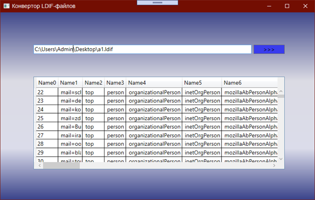
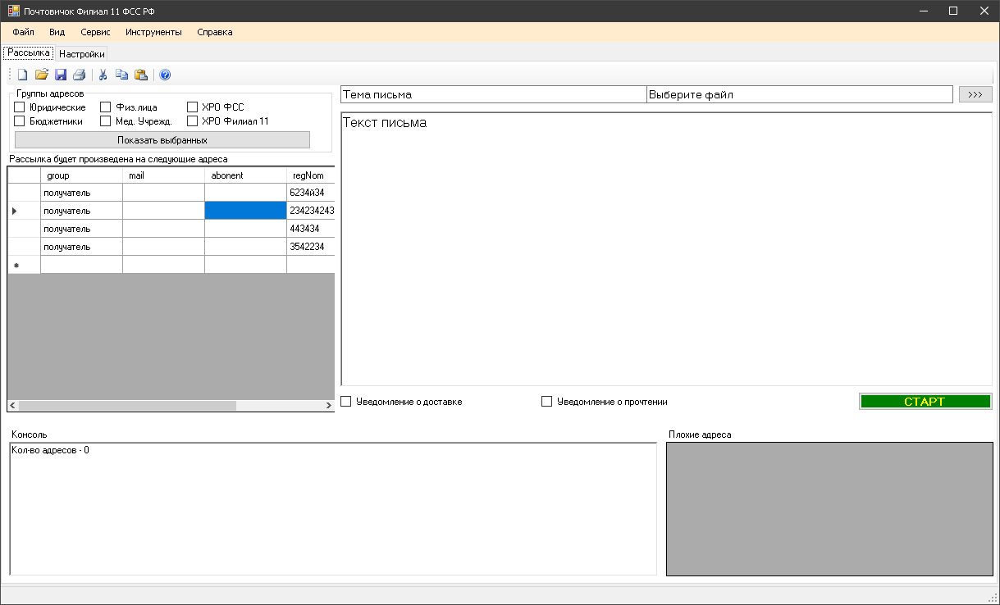

# АРМ сборник проектов
Рабочее место сотрудника офиса

#### Выписки МНС

Выписки МНС , парсинг файлов XML приходящих из Налоговой импорт в ЕИИС, дальнейшие операции , 
данные  из XML и ЕИИС

#### Органайзер

 

#### Конвертор LDIF файлов в CSV файл

  Для удобного чтения файлов LDIF

во время открытия LDIF файла создаеться CSV файл и сохраняеться в этой же директории 

#### Панель Подсистем ЕИИС

Единое окно запуска подсистем ЕИИС

Проект на C# 

своего рода такой комбайн

панель настроек

#### Почтовичек
   C# + SQLite 
  Проект Visual C# Express 2010  WinFoms, делалось на досуге, подойдет студентам. Изначально была попытка сделать простенький почтовый клиент с удобной и быстрой рассылкой писем, и простейшим конструктором писем.
    
  Добавлены файлы microsoft.office.interop.excel.dll и system.data.sqlite.dll для того чтобы не искать, а сразу можно работать

#### ЗАГС - ЕИИС

В папке несколько проектов и на C# WinForms и на С# WPF
C HyTech все работают через ODBC, разница вся только в визуализации интерфейса.

#### ФГИС ЕГР ЗАГС - ЕИИС

Сверка ЕИИС с выгрузкой ФГИСЕГР, зайти  на сайт ФГИСЕГР сделайте выгрузку списка умерших в Ексель файл , откройте этот файл пересохраните, ОБЯЗАТЕЛЬНО

версия 10

панель подключения 

макет отчета

