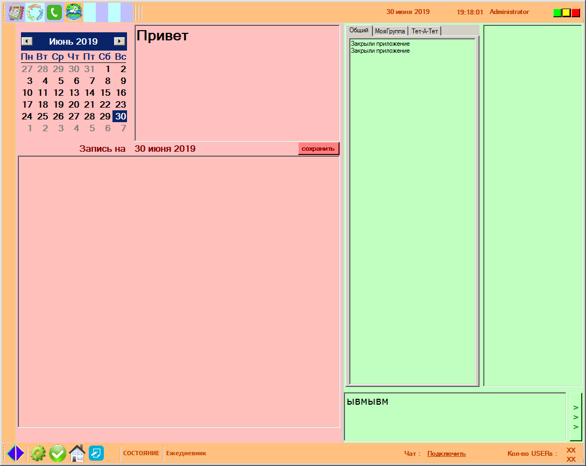
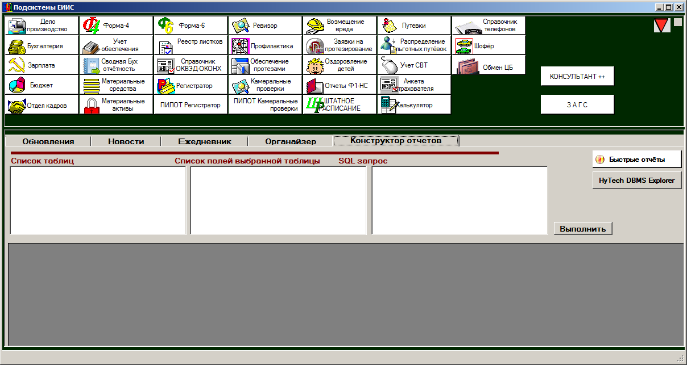
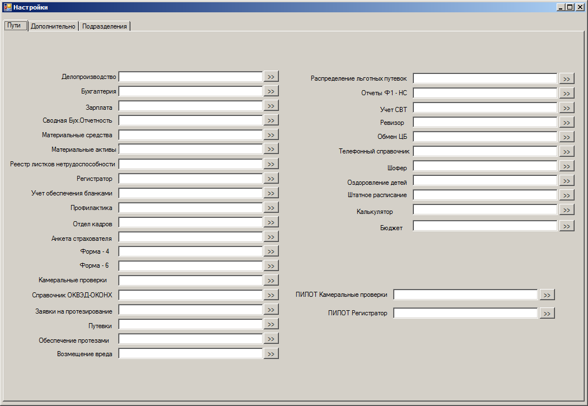
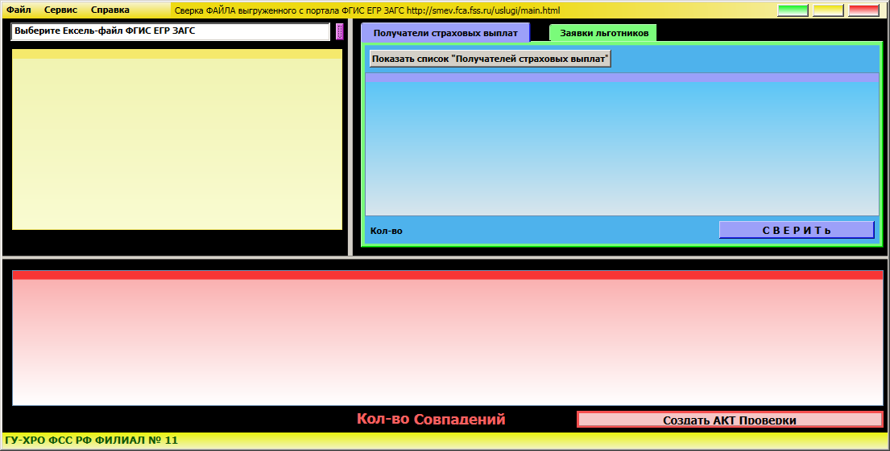
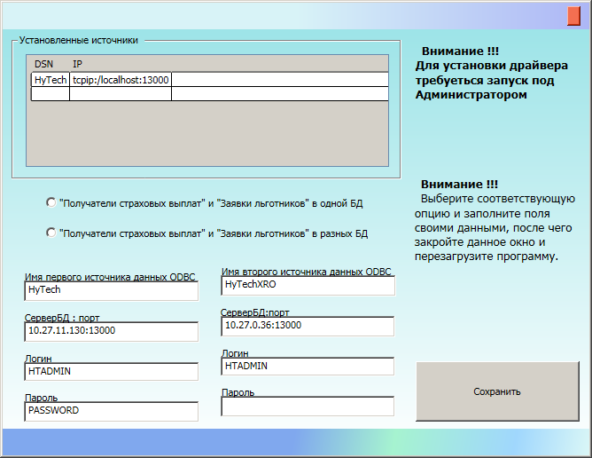
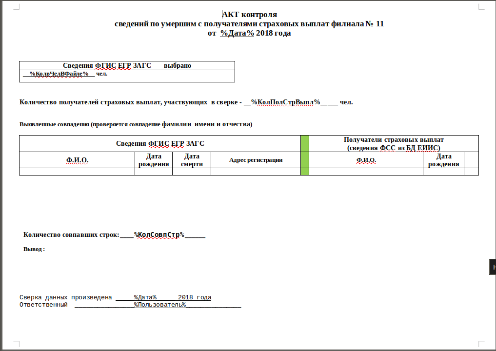

# АРМ сборник проектов
Рабочее место сотрудника офиса

#### Органайзер

 

#### Панель Подсистем ЕИИС

Единое окно запуска подсистем ЕИИС

Проект на C# 

своего рода такой комбайн

панель настроек

#### ЗАГС - ЕИИС

В папке несколько проектов и на C# WinForms и на С# WPF
C HyTech все работают через ODBC, разница вся только в визуализации интерфейса.

#### ФГИС ЕГР ЗАГС - ЕИИС

Сверка ЕИИС с выгрузкой ФГИСЕГР, зайти  на сайт ФГИСЕГР сделайте выгрузку списка умерших в Ексель файл , откройте этот файл пересохраните, ОБЯЗАТЕЛЬНО

версия 10

панель подключения 

макет отчета

